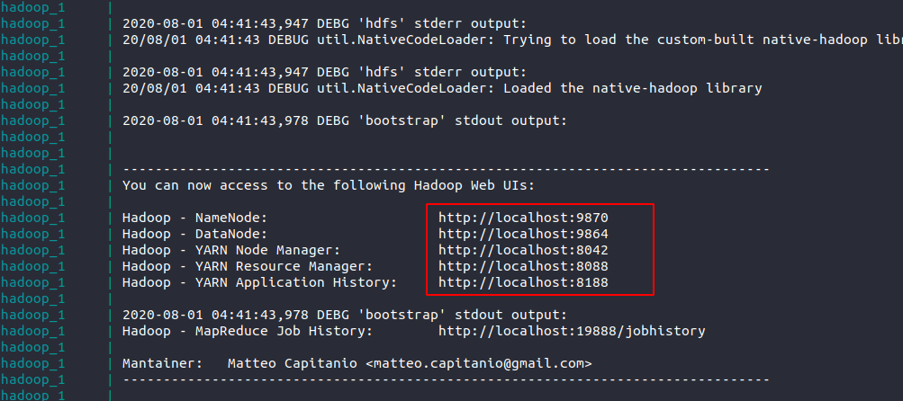
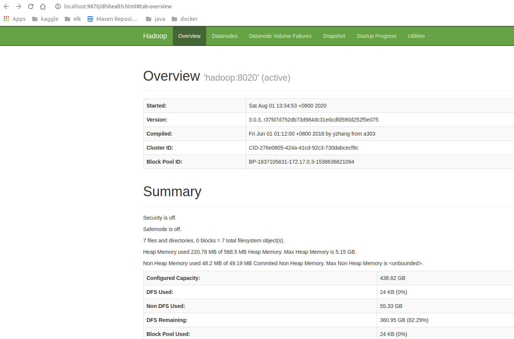
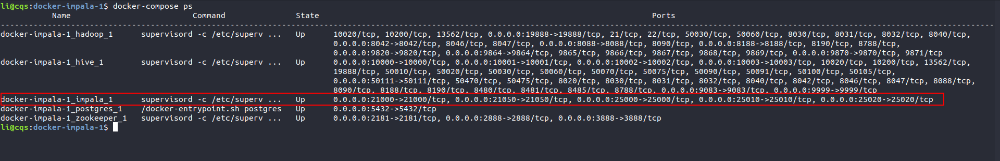
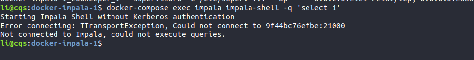
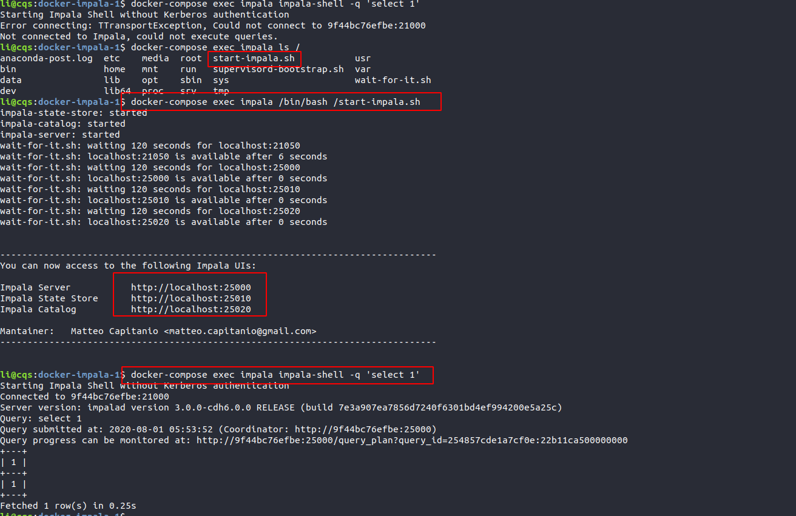
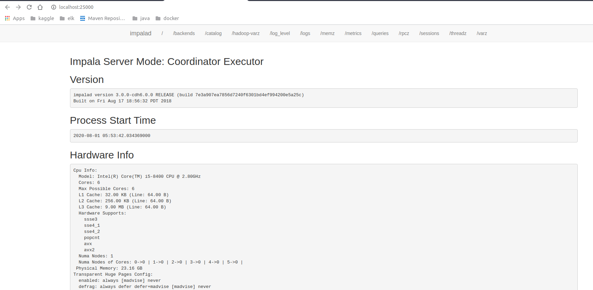
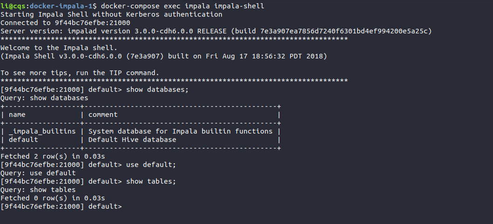
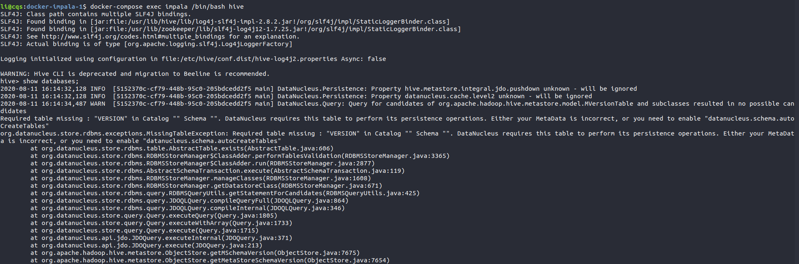
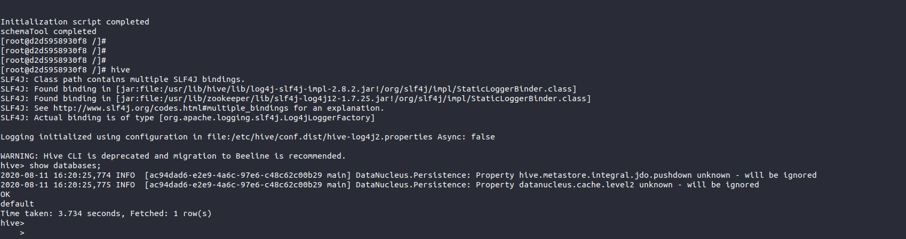
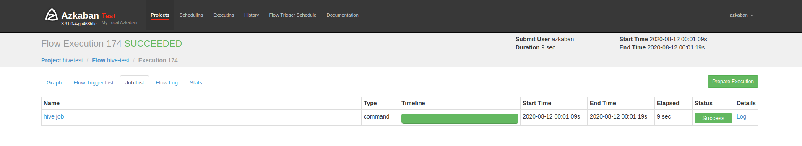

# **docker-impala**
___

### Description
___

This image runs [*Cloudera Impala*](https://www.cloudera.com/products/open-source/apache-hadoop/impala.html) distribution on HDFS.

You can pull it with:

    docker pull parrotstream/impala


You can also find other images based on different Apache Impala releases, using a different tag in the following form:

    docker pull parrotstream/impala:[impala-release]-[cdh-release]


Stop with Docker Compose:

    docker-compose -p parrot

Setting the project name to *parrot* with the **-p** option is useful to share the network created with the containers coming from other Parrot docker-compose.yml configurations.

Once started you'll be able to access to the following UIs:

| **Impala Web UIs**           |**URL**                    |
|:----------------------------|:--------------------------|
| *Impala State Store Server* | http://localhost:25010    |
| *Impala Catalog Server*     | http://localhost:25020    |
| *Impala Server Daemon*      | http://localhost:25000    |

### Available tags:

- Apache Impala 3.0.0-cdh6.0.0 ([latest](https://github.com/parrot-stream/docker-impala/blob/latest/Dockerfile), [3.0.0-cdh6.0.0](https://github.com/parrot-stream/docker-impala/blob/3.0.0-cdh6.0.0/Dockerfile))
- Apache Impala 2.8.0-cdh5.15.1 ([2.12.0-cdh5.15.1](https://github.com/parrot-stream/docker-impala/blob/2.12.0-cdh5.15.1/Dockerfile))
- Apache Impala 2.8.0-cdh5.11.1 ([2.8.0-cdh5.11.1](https://github.com/parrot-stream/docker-impala/blob/2.8.0-cdh5.11.1/Dockerfile))


## 启动AND使用


1. 启动方式
```shell
docker-compose up 
```
2. 观察日志, 看Hadoop是否启动

   

   访问浏览器看服务是否正常启动

   

3. 脚本启动后，通过命令查看五个服务都是UP状态的

   

   但是我们通过命令测试的发现是impala启动会异常

   

   **分析之后发现是impala没有启动，执行手动启动命令**

   ```
   docker-compose exec impala /bin/bash /start-impala.sh 
   ```

   

   

​      

​      上图看出启动和测试是成功的


4. impala使用

   ```shell
   docker-compose exec impala impala-shell
   ```

   


5. 若进入hive环境报错的话

   ```shell
   docker-compose exec impala /bin/bash hive 
   ```

   

   

6. 若执行hive命名报错可以先初始化数据库. 可以依次执行
```
docker-compose exec impala /bin/bash
mv /var/lib/hive/metastore/metastore_db /var/lib/hive/metastore/metastore_db.tmp
/usr/lib/hive/bin/schematool   -initSchema -dbType derby
```

```shell
li@cqs:docker-impala-1$ docker-compose exec impala /bin/bash 
[root@d2d5958930f8 /]# 
[root@d2d5958930f8 /]# 
[root@d2d5958930f8 /]# /usr/lib/hive/bin/schematool   -initSchema -dbType derby
SLF4J: Class path contains multiple SLF4J bindings.
SLF4J: Found binding in [jar:file:/usr/lib/hive/lib/log4j-slf4j-impl-2.8.2.jar!/org/slf4j/impl/StaticLoggerBinder.class]
SLF4J: Found binding in [jar:file:/usr/lib/zookeeper/lib/slf4j-log4j12-1.7.25.jar!/org/slf4j/impl/StaticLoggerBinder.class]
SLF4J: See http://www.slf4j.org/codes.html#multiple_bindings for an explanation.
SLF4J: Actual binding is of type [org.apache.logging.slf4j.Log4jLoggerFactory]
Metastore connection URL:	 jdbc:derby:;databaseName=/var/lib/hive/metastore/metastore_db;create=true
Metastore Connection Driver :	 org.apache.derby.jdbc.EmbeddedDriver
Metastore connection User:	 APP
Starting metastore schema initialization to 2.1.1-cdh6.0.0
Initialization script hive-schema-2.1.1.derby.sql

 
Error: FUNCTION 'NUCLEUS_ASCII' already exists. (state=X0Y68,code=30000)
org.apache.hadoop.hive.metastore.HiveMetaException: Schema initialization FAILED! Metastore state would be inconsistent !!
Underlying cause: java.io.IOException : Schema script failed, errorcode 2
Use --verbose for detailed stacktrace.
*** schemaTool failed ***
[root@d2d5958930f8 /]# mv /var/lib/hive/metastore/metastore_db /var/lib/hive/metastore/metastore_db.tmp
[root@d2d5958930f8 /]# /usr/lib/hive/bin/schematool   -initSchema -dbType derby
SLF4J: Class path contains multiple SLF4J bindings.
SLF4J: Found binding in [jar:file:/usr/lib/hive/lib/log4j-slf4j-impl-2.8.2.jar!/org/slf4j/impl/StaticLoggerBinder.class]
SLF4J: Found binding in [jar:file:/usr/lib/zookeeper/lib/slf4j-log4j12-1.7.25.jar!/org/slf4j/impl/StaticLoggerBinder.class]
SLF4J: See http://www.slf4j.org/codes.html#multiple_bindings for an explanation.
SLF4J: Actual binding is of type [org.apache.logging.slf4j.Log4jLoggerFactory]
Metastore connection URL:	 jdbc:derby:;databaseName=/var/lib/hive/metastore/metastore_db;create=true
Metastore Connection Driver :	 org.apache.derby.jdbc.EmbeddedDriver
Metastore connection User:	 APP
Starting metastore schema initialization to 2.1.1-cdh6.0.0
Initialization script hive-schema-2.1.1.derby.sql

Initialization script completed
schemaTool completed
[root@d2d5958930f8 /]# 

```

测试如下：



然后就可以使用该容器进行azkaban测试了hive任务了

